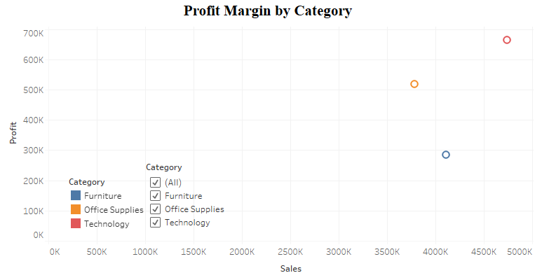
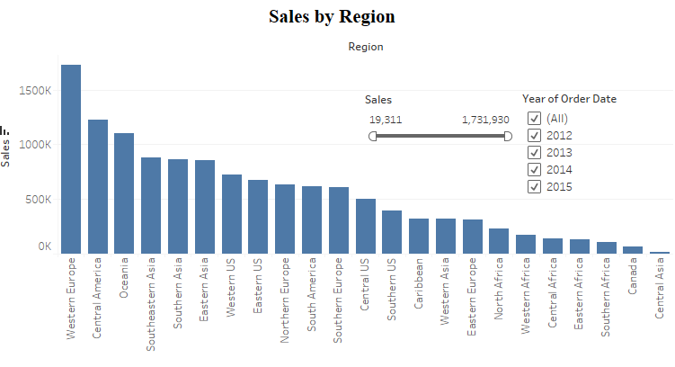
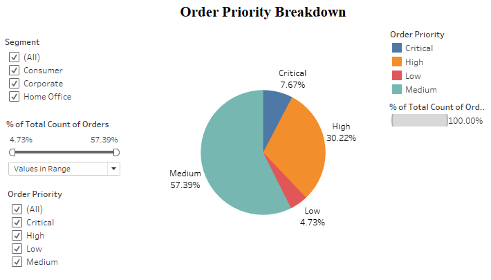
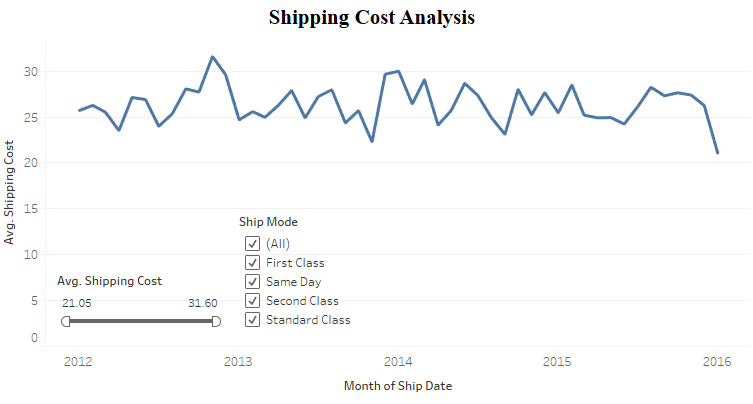
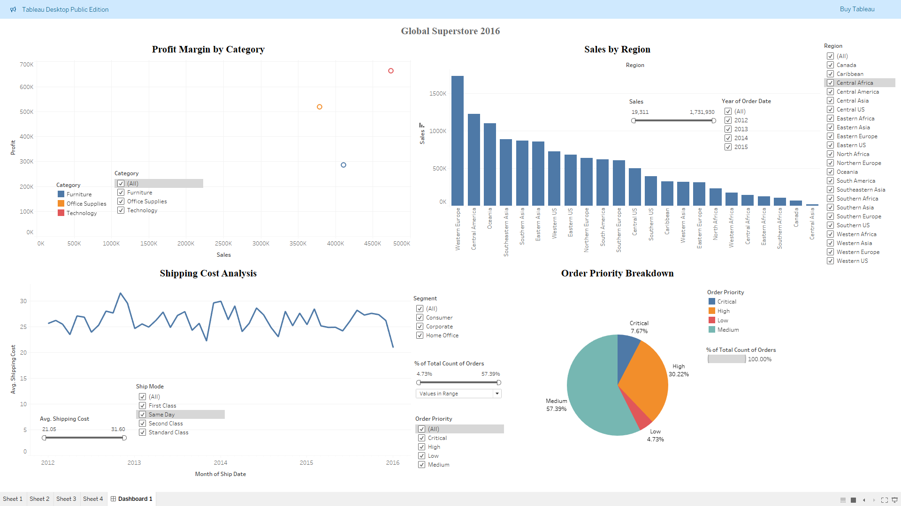

# Tableau Projects

<h2>
Global Superstore 2016
</h2>

### Abstract
Tableau was used to construct 4 different visualisations to aid in the analysis of a global superstore. Each visual was contructed to correspond to a particular area of the business which could be analysed further. All visualisations were then combined onto a single dashboard for easy viewing.

### Dataset
- **Source** global_super_2016.xlsx
- **Relevant Fields:**
    - Category, Segment, Region, 'Ship Mode', 'Ship Date', 'Order Date', Sales, Quantity, Profit, 'Shipping Cost', 'Order Priority'
 
### Visualisations
1. Sales by Region
    - Type: Bars (Column)
    - Shows Sales as a function of Region with sorting applied such that Regions appear in a descending order of sales.
2. Profit Margin by Category
    - Type: Scatter Plots
    - Shows Sum of Profit as a function of Sum of Sales with each data point representing 1 of the 3 following category types:
      - Technology
      - Office Supplies
      - Furniture
3. Shipping Cost Analysis
    - Type: Lines (Continuous)
    - Shows average shipping cost for each month as a function of said month for each month in the period: Jan 2012–Jan 2016. The datapoints are then joined together by a straight lines
4. Order Priority Breakdown
    - Type: Pie Chart
    - Shows a percentage breakdown out of total orders made for all 4 'Order Priority' types:
      - Critical
      - High
      - Medium
      - Low

<!--(https://www.apple.com/uk/)
(https://www.apple.com/uk/)
(https://www.apple.com/uk/)
(https://www.apple.com/uk/)
(https://www.apple.com/uk/)
-->
     
### Dashboard
Aforementioned visualisations were then combined onto a single Tableau Dashboard wherein filters associated with a given visualisation were then linked to other visualisations. Every visual on the dashboard then responded directly to any changes made to filtering options for the following fields and derived fields:
  - Category
  - 'Year of Order Date'
  - Region
  - 'Order Priority'
  - Segment
  - 'Ship Mode'

For visualisations 1, 3 & 4, it was also made possible to filter for specific values in: Sales, Average Shipping Cost or percentage of total orders; thus changing what: months, Regions or Order Priorities would be shown on the dashboard respectively.
